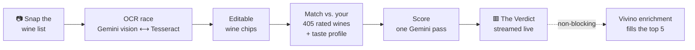

# 🍷 Decant

**Point your phone at a restaurant wine list. Get the bottle *you'll* love, in seconds.**

[](https://decant-one.vercel.app)


> I rated **400+ wines on Vivino** between 2016 and today, then let that data sit dormant for the better part of a decade. Decant wakes it up. Every recommendation is reasoned against my own ten years of taste, not a crowd average.

That's the whole idea: the wine list in front of you is generic. Your palate isn't. Decant reads the menu, holds it up against what you've actually loved, and tells you what to order.

📱 **Try it:** [decant-one.vercel.app](https://decant-one.vercel.app) (add to your home screen for the full app)

---

## From photo to pour



1. **Scan.** Snap one page or several. A Gemini Flash vision model and `tesseract.js` race to read the list; first usable result wins.
2. **Confirm.** Parsed wines appear as editable chips, because stylized menus lie to OCR and you should get the final say before scoring.
3. **Recognize.** Each wine is checked against 405 personally-rated bottles and a synthesized taste profile. Matching is deliberately strict (winery + grape, or a tight edit-distance) so a near-miss never gets credit for a wine you never drank.
4. **Score.** A single Gemini call ranks the whole list against your palate, all wines and your profile in one shot.
5. **The Verdict.** Results stream back over SSE so the pick lands fast, then live Vivino data (community score, region, image) fills in the top five. Enrichment is always optional: if Vivino is unreachable, the app degrades gracefully and keeps the AI scores.

## A few things it does on purpose

- **Speed is the feature.** Perceived latency is the product. OCR aims for a few seconds, the recommendation for under ten, and Vivino enrichment never blocks the answer.
- **Built for one palate (mine).** This isn't a crowd-rating reskin. The signal is a decade of *personal* ratings, which is exactly what makes the picks feel uncanny.
- **No official Vivino API.** The wine data comes from carefully throttled, reverse-engineered endpoints. They can break without notice, so everything downstream treats Vivino as a bonus, not a dependency.

## The look: a patient little cellar

Decant has a real design system, and it commits to a mood.

- **Palette:** bordeaux `#7A1220`, cream `#F5EFE6`, aged-gold `#A8855B`, bottle-green `#3E5C44` on near-black ink.
- **The mark:** a **wax seal**, a bordeaux disc with an embossed *D*. It's the logo, the app icon, the loading spinner, and the stamp on your final Verdict.
- **Motion:** every transition is about 1.3× slower than feels necessary. Good wine isn't rushed, and neither is the UI.
- Light by default, auto-dark for dim restaurants.

## Stack

`Next.js 15` · `React 19` · `Tailwind 4` · `@google/genai` (Gemini vision + scoring) · `tesseract.js` (on-device OCR fallback) · `axios` · `zod` · installable PWA on `Vercel`.

## Running it yourself

```bash
npm install
npm run dev               # http://localhost:3000
npm run build-rated-index # rebuild the personal-ratings index
npm run build             # production build
```

Environment (`.env.local`):

| Var | Purpose |
|-----|---------|
| `GEMINI_API_KEY` | Vision OCR + scoring |
| `VIVINO_SESSION_COOKIE` | Live Vivino enrichment (the `_ruby-web_session` value) |
| `VIVINO_USER_ID` | Which Vivino account to read ratings from |

The personal ratings index ships in `lib/rated-wines.json` and the Vivino client is ported from the companion [vivino-mcp-server](https://github.com/madfreakz/vivino-mcp-server).

## Repo map

```
app/scan            the camera-to-verdict flow
app/api/ocr-page    Gemini vision + Tesseract OCR race
app/api/parse-wines list -> structured, deduped wines
app/api/recommend   scoring + SSE Verdict stream
lib/gemini.ts       OCR, parse, and scoring model calls
lib/vivino.ts       throttled, cookie-auth Vivino client
lib/taste-profile.ts your synthesized palate
lib/rated-wines.json 405 rated bottles, indexed
```

---

<sub>A personal project by [@madfreakz](https://github.com/madfreakz). Drink the data. 🥂</sub>
